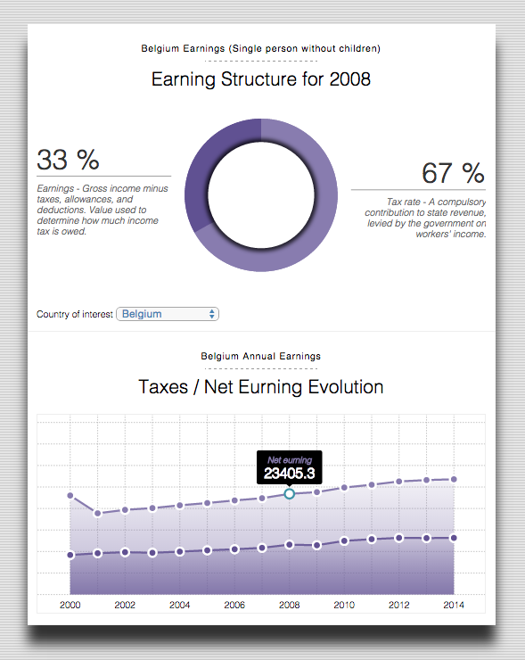
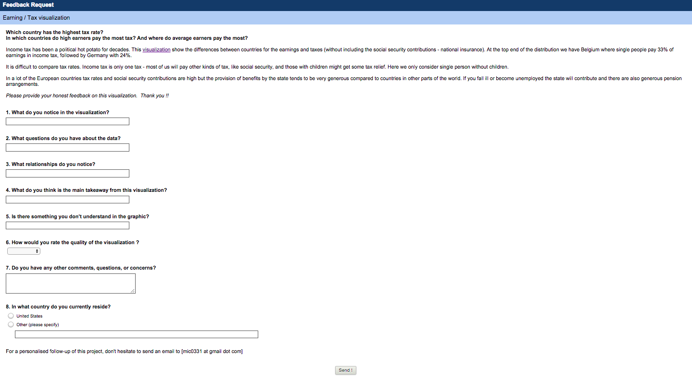
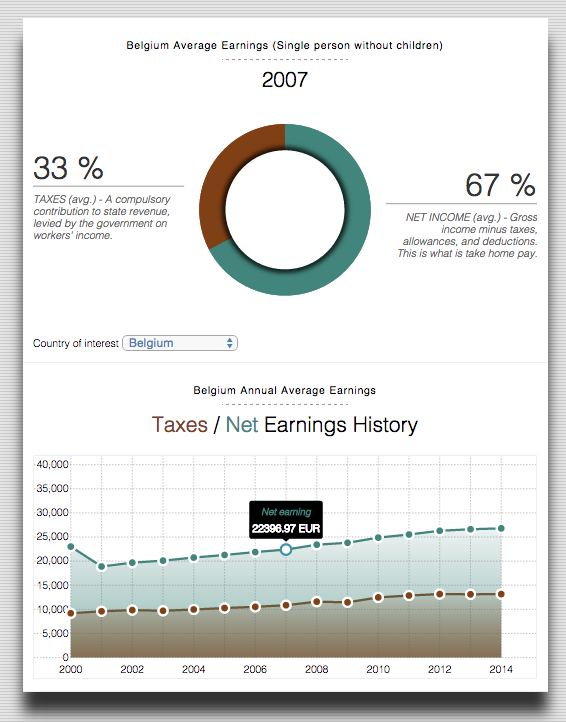

##### Author : Michaël Lambé (mic0331 at gmail dot come)
## Summary
### Which country has the highest tax rate?
In which countries do high earners pay the most tax? And where do average earners pay the most?
This **[visualization](https://radiant-basin-3159.herokuapp.com/)** show the differences between countries for the net earnings and taxes (without including the social security contributions - national insurance).

At the top end of the distribution we have Belgium where single people pay 33% of gross earnings in income tax, followed by Germany with 24%.

In a lot of the European countries tax rates are high but the provision of benefits by the state tends to be very generous compared to countries in other parts of the world.

*Note: some countries was missing data for some year. The choice has been made to replace the missing value by the mean of the taxes or net earnings from all years.*
## Initial Design Decision
The data (coming from [Eurostat](http://appsso.eurostat.ec.europa.eu/nui/show.do?dataset=earn_nt_net&lang=en)) are available on a yearly basis therefore, it was making sence to display a multi-line chart to express the evolution / trend of the tax / net earning from year to year.
For an individual year, the pie chart on the top show percentage in a nice way so the reader can immediatly see the ratio of tax vs. net earnings.
When the user mouve over a dot of the line graph, the pie chart display the corresponding ratio of the selected year.  
The choice has been made to **NOT** show the y axis to avoid an overload of information on the screen.  The user interested by a specific value of the line graph can get it when a circle is selected.
User can choose a country by selecting an item in the combo box where a callback event is triggered to the server to retreive the needed data and refresh the charts.
The charts are using the same base color (`hex : #403075`), a ligher and darker version of this color is used to show respectively the earnings and taxes.

The next picture show the initial version of the visualization.

## Feedback
For collecting feedback, a dedicated Monkey Survey has been open for few days.

The following questions where asked :

* What do you notice in the visualization?
* What questions do you have about the data?
* What relationships do you notice?
* What do you think is the main takeaway from this visualization?
* Is there something you don’t understand in the graphic?
* How would you rate the quality of the visualization ? from very good to very bad
* Do you have any other comments, questions, or concerns?
* In what country do you currently reside?

The survey (conduted for about a week between the 11th till the 16th of June) has been posted on various channel (udacity forum, reddit, twitter, goodle +) in order to maximized the number of feedback.
Overall, about 10 people reply and share some interesting comments about the quality and the possible improovement of the charts ([results of the survey](feedback.md))

During the survey, several actions has been taken day after day based on recommendations made by the community.

1. A swap was made in the labels of the pie chart, this has been fixed immediatly.
2. The coloring has been change to use a red / green combination that was working well for this type of visualization.
3. A y-axis has been added for the multiple-line chart.
4. typos were fixed.
5. labels and titles were carefully re-writter to clearly explain the percentage and charts.

In order to further improove the project, one suggestion was made to use a [Normalized Stacked Bar Chart](http://bl.ocks.org/mbostock/3886394).  This is something that will be considered later to further explain the differences between countries.

Finally, several people mention that social security contribution, familly allowances, etc. were key information to show in this graph.  This is also a point of concern that will be investigate later to irmpoove the chart.

The final UI of the project is much better.  This has been confirmed by the feedback that were much better at the end of the survey campaign.

## Technological choices

*Note: This section is far beyond the scope of the the project, it is intended for reader interested to contribute on the project or just interested to deploy the fullstack solution locally.*

The web-based visualization has been implemented using an API developped for this project.  
The technology used are **mongodb, node.js, python, html (jade template), css and D3.js**.
The mini-project is hosted on [heroku](https://www.heroku.com/) and the database on [mongolab](https://mongolab.com/).  Both cloud solution are offering a free tier ideal for this proof-of-concept type of project.

The project source code folder contain two main area of interest.

1. **Preprocessing**

Source file :
* [preprocessor.py](https://github.com/mic0331/eurostat/blob/master/preprocessing/preprocessor.py)
* [API](https://github.com/mic0331/eurostat/tree/master/server/api/eurostat)
* [index.jade](https://github.com/mic0331/eurostat/blob/master/server/views/index.jade)
* [app.js](https://github.com/mic0331/eurostat/blob/master/public/app/app.js)

This is where the raw data material from [eurostat](http://appsso.eurostat.ec.europa.eu/nui/show.do?dataset=earn_nt_net&lang=en) are stored (`/proprocessing/data/earn_nt_net.tsv`). The python file `preprocessing/preprocessor.py` is used to load the initial data, manipulate them and eventually perform some cleaning.  
The data was initialy coming from a TSV format and they were converted into JSON. `preprocessor.py` is also responsible to upload the data in mongodb where they will be consumed by the webapp.

2. **Webapp**
The root directory contain the webapp developed using the `express.js` framework. The structure of the webapp is very simple to understand.  The folder `server/api` contains endpoints consumed by the webpage.  For this project only the eurostat endpoint is used.  The folder `public` is where the webpage magic is happening.  The core of the implementation of the d3.js logic is in the file `public/app/app.js`.

For the reader interested to run the project locally, he should make sure mongodb, node.js and python3 are installed locally.
Next, NPM package manager should also be installed with the three global 
packages `gulp`, `nodemon`, `browser-sync` and `bower`.

To run the project, follow these steps :

1. Clone the repository

2. Make sure mongodb is running on default port and a db is created with the name `eurostat`.

3. In the folder `proprocessing` run 

    `>>>  python preprocessor.py`
    (will load the data in mongodb)

4. Still in the root folder run the command

    `>>>  npm inslall`
    (will install the local packages needed by the backend)

    `>>>  bower install`
    (will install the local packages needed by the frontend)

    `>>>  nodemon server`
    or
    `>>> node server`
    (this will start the webapp)

5. Navigate to `http://localhost:3030/`

6. The api can be access at `http://localhost:3030/api/v1/eurostat/basic/country/BE` where the final parameter can be changed according to the country of interest.

7. [OPTIONAL] During the devlopment phase of this project, `browsersync` has been used in order to have immediate feedback on the screen when a code modication was made. To run the project in development mode, simply run :

    `>>> gulp`

Then navigate to `http://localhost:4000/`

## Conclusion
Finding an interesting data set and a story it tells can be the most difficult part of producing an infographic or data visualization.

Data visualization is the end artifact, but it involves multiple steps – finding reliable data, getting the data in the right format, cleaning it up (an often underestimated step in the amount of time it takes!) and then finding the story you will eventually visualize.

Finally, the feedback received for the project were very useful and clearly this part of the project was very interesting especially considering the various point of view from prople with different background.

## Resources
* [Eurostat - Net earnings and tax rates (earn_net)](http://appsso.eurostat.ec.europa.eu/nui/show.do?dataset=earn_nt_net&lang=en)
* [Eurostat - Net earnings and tax rates (metadata)](http://ec.europa.eu/eurostat/cache/metadata/en/earn_net_esms.htm)
* [programming - how to use d3.json](https://gist.github.com/mbostock/3750941)
* [programming - context and d3.json](http://stackoverflow.com/questions/30780654/how-to-properly-control-the-context-when-using-d3-json-event-handler/30780795?noredirect=1#comment49612132_30780795)